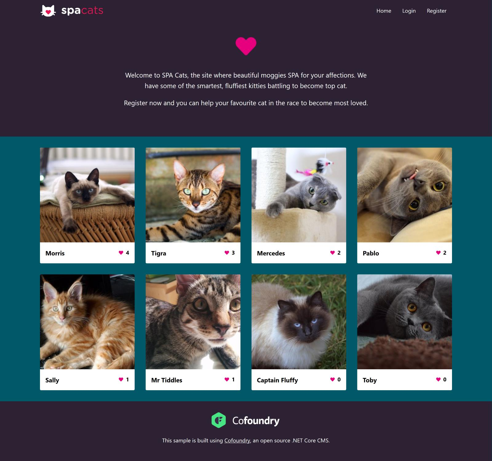

# SPA Cats Vue Sample

This is a detached version of the [SPASite Cofoundry CMS sample app](https://github.com/HeyJoel/Cofoundry.Samples.SPASite/tree/feature/vue) that doesn't require .NET Core or SqlServer. All API calls are routed to static json files so you can simply run the app using the Vue.js CLI

#### To get started:

- Install dependencies with `npm install`
- Run the app with `npm run serve`

## App Overview

*SPA Cats* is a simple site that lets you browse and rate cats. Users can browse the data, register as a member and vote for their favorite cat.

## Managing content

The app was originally designed as a sample application for Cofoundry, an open source .NET Core CMS. 

Check out the [original sample repo](https://github.com/HeyJoel/Cofoundry.Samples.SPASite/tree/feature/vue) for more information.

